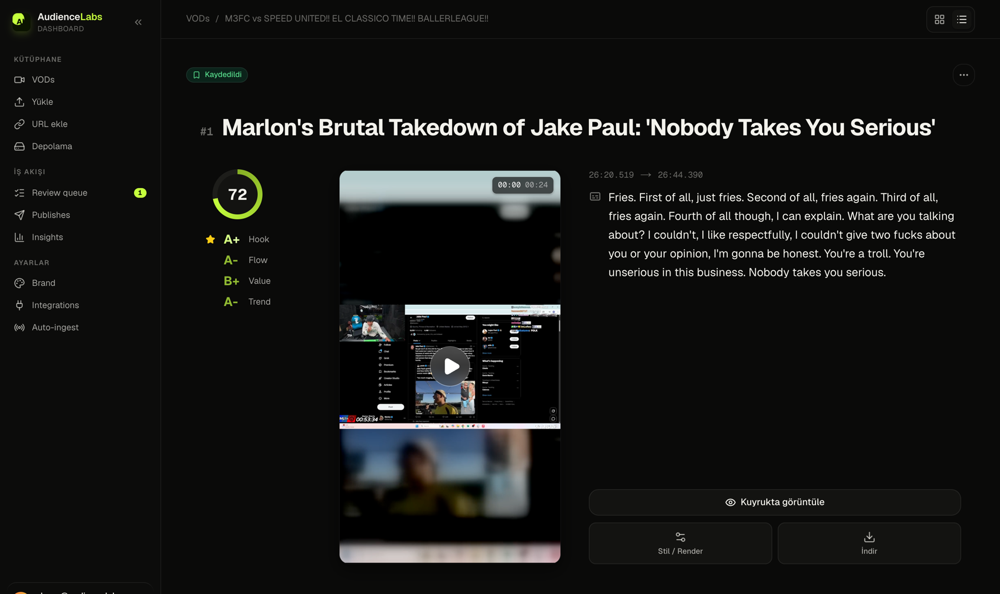
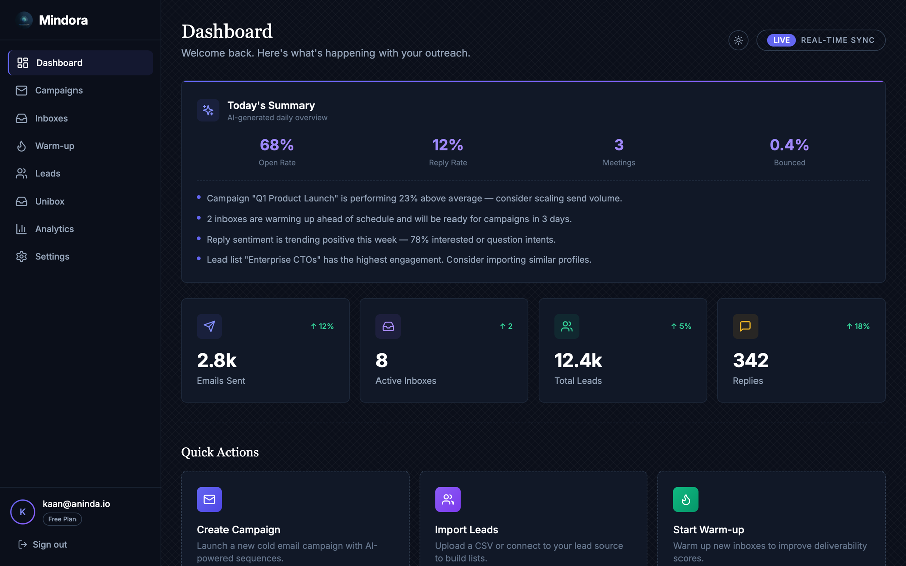

# Hi, I'm Kaan

Developer from Istanbul. I like taking a product from idea to something people can actually use: frontend, backend, infra and the boring glue in between.

## What I'm building

### Audience Labs

Clip automation for streamers. You paste a Twitch or Kick VOD link, the pipeline transcribes it with Whisper on GPU, an LLM finds and scores the moments worth posting, and the app renders vertical clips with word-level captions, ready to review and schedule for TikTok, YouTube Shorts and Instagram Reels.

Next.js 16 dashboard, Python worker (yt-dlp, FFmpeg, faster-whisper), Supabase for data and realtime, Cloudflare R2 for storage, Modal for GPU jobs. The app code is private while it heads to launch; the [landing page](https://github.com/kaankuzu1/growthlanding) is public.

### Aninda

Cold email platform for agencies: multi-inbox campaigns with A/B variants, automated warmup, lead verification and reply intent detection. NestJS API, Next.js dashboard, BullMQ workers, Supabase. Source: [Anindav2](https://github.com/kaankuzu1/Anindav2)

## Other projects

- [IntenseRPG11](https://github.com/kaankuzu1/IntenseRPG11): on-chain RPG items in Sui Move, written while learning the language
- [ProjectCalculator](https://github.com/kaankuzu1/ProjectCalculator): one of my first projects, a plain HTML/CSS/JS calculator ([live](https://kaankuzu1.github.io/ProjectCalculator/))

## Tools I use most

